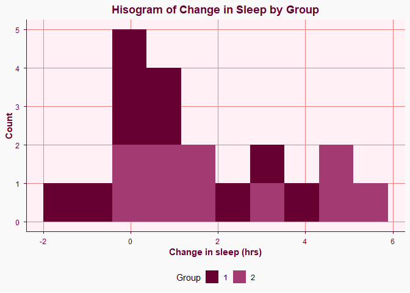

<!-- README.md is generated from README.Rmd. Please edit that file -->

# package306

<!-- badges: start -->

<!-- badges: end -->

The goal of package306 is to provide simple tools for cleaning data and
creating consistent, visually appealing data visualizations. The package
includes a helper function for cleaning data frames, a custom ggplot2
theme, and a pink-themed brand.

## Installation

You can install the development version of package306 from
[GitHub](https://github.com/) with:

``` r
# install.packages("pak")
pak::pak("ajp034-web/package306")
```

## Functions

## Clean

The clean() function provides a simple way to prepare a data frame for
analysis. It can: - Remove rows containing missing values - Remove
duplicate observations - Standardize column names by converting them to
lowercase

Users can choose which cleaning steps to apply using the remove_missing
and remove_duplicate arguments.

``` r
library(package306)

data <- data.frame(
  Name = c("Taylor", "Taylor", "Adele"),
  Score = c(10, 10, NA)
  )

#Only normalize Column Names
clean(data, remove_missing = FALSE, remove_duplicate = FALSE)
#>     name score
#> 1 Taylor    10
#> 2 Taylor    10
#> 3  Adele    NA

#Normalize Column Names and Remove Duplicate Observations
clean(data, remove_missing = FALSE)
#>     name score
#> 1 Taylor    10
#> 3  Adele    NA

#Normalize Column Names and Remove Rows w/ Missing Values
clean(data, remove_duplicate = FALSE)
#>     name score
#> 1 Taylor    10
#> 2 Taylor    10

#Normalize Column Names, Remove Duplicate Observations, and Remove Rows w/ Missing Values
clean(data)
#>     name score
#> 1 Taylor    10
```

## My Theme

The my_theme() function is a custom ggplot2 theme designed to create a a
pink and berry color palette, adjust gridlines, and use a custome font.
The theme also includes custom fill and color scales.

``` r
library(ggplot2)

ggplot(sleep, aes(x = extra, fill = group)) +
  geom_histogram(bins=10) +
  my_theme() +
  labs(
    title = "Hisogram of Change in Sleep by Group",
    x = "Change in sleep (hrs)",
    y = "Count",
    fill = "Group"
  )
```



## Branding and Accessibility

Package306 uses a pink and berry color palette to create a cohesive
visual style. The colors range from light pinks to dark berry tones.
This allows for different colors to be used for backgrounds, accents,
and text. The branding of the package uses the Dongle font from Google
Fonts for both body text and headings. This font was selected to match
the aesthetic of the color palette.

Accessibility was considered when selecting the color palette. The dark
berry color is used as the primary foreground color against the light
pink background to provide sufficient contrast and maintain readability.
The color palette was also evaluated using color accessibility and
contrast-checking tools and passed.

## Vignette

A more detailed explanation of the package can be found in the package
vignette. There are demonstrations of clean() and my_theme(). There are
also examples of data moves such as mutate(),filter(), join(),
arrange(), group_by(), and summarize().
